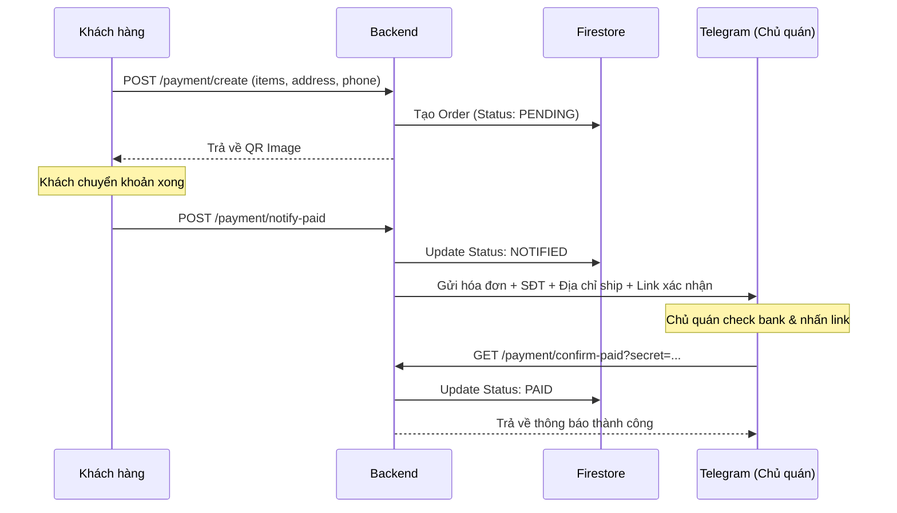

# Tài liệu Kỹ thuật: Tích hợp Thanh toán VietQR (Mô hình Delivery)

Tài liệu này mô tả chi tiết kiến trúc, luồng dữ liệu và các thông số kỹ thuật của hệ thống thanh toán qua VietQR cho mô hình **Đặt hàng từ xa / Giao hàng**.

---

## 1. Tổng quan (Overview)
Hệ thống hỗ trợ quy trình đặt hàng từ xa, khách hàng nhận mã QR để thanh toán và chủ quán nhận thông tin giao hàng qua Telegram để xử lý đơn.

- **Mục tiêu**: Tối ưu chi phí (0% phí giao dịch), quản lý đơn hàng giao đi dễ dàng.
- **Công nghệ**: FastAPI, Firestore, Telegram Bot API.

---

## 2. Quy trình Nghiệp vụ (Delivery Model)



---

## 3. Chi tiết API (API Specification)

### 3.1. Tạo yêu cầu thanh toán (JSON)
- **Endpoint**: `POST /api/v1/payment/create`
- **Body**:
```json
{
  "amount": 135000,
  "store_id": "STORE_01",
  "customer_name": "Anh Thuận",
  "phone_number": "0901234567",
  "address": "123 Đường ABC, Quận 1, TP.HCM",
  "items": [
    {"name": "Phở bò", "quantity": 2, "price": 60000}
  ]
}
```

### 3.2. Khách báo đã chuyển khoản
- **Endpoint**: `POST /api/v1/payment/notify-paid?order_id=...`
- **Chức năng**: Chuyển trạng thái sang `NOTIFIED` và bắn tin nhắn Telegram (kèm thông tin ship hàng).

### 3.3. Admin xác nhận (Dùng cho link Telegram)
- **Endpoint**: `GET /api/v1/payment/confirm-paid`
- **Params**: `order_id`, `secret`.
- **Chức năng**: Chuyển trạng thái sang `PAID`.

---

## 4. Mô hình dữ liệu (Firestore)
Collection: `orders`
- `id`: Order ID.
- `items`: Danh sách món ăn.
- `status`: `PENDING`, `NOTIFIED`, `PAID`.
- `address`: Địa chỉ giao hàng.
- `phone_number`: Số điện thoại khách hàng.
- `notified_at`: Thời điểm khách báo đã chuyển.
- `confirmed_at`: Thời điểm chủ quán xác nhận.
